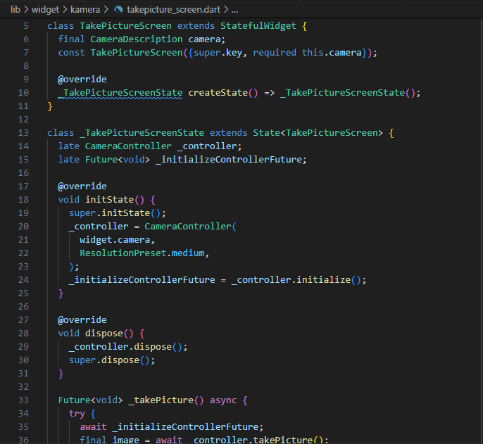

TUGAS PRAKTIKUM

Nama: Febby Mathelda Silvya Mooy

Kelas: TI 3A

NIM : 2241720067

1. Selesaikan Praktikum 1 dan 2, lalu dokumentasikan dan push ke repository Anda berupa screenshot setiap hasil pekerjaan beserta penjelasannya di file README.md! Jika terdapat error atau kode yang tidak dapat berjalan, silakan Anda perbaiki sesuai tujuan aplikasi dibuat!

link repo praktikum 1: https://github.com/febbymathelda/kamera_flutter

link repo praktikum 2: https://github.com/febbymathelda/photo_filter_carousel

2. Gabungkan hasil praktikum 1 dengan hasil praktikum 2 sehingga setelah melakukan pengambilan foto, dapat dibuat filter carouselnya!

Jawab:

Tambah Dependensi:

Takepicture_screen.dart

displaypicture_screen.dart

filter_selector.dart

filter_carousel.dart

carousel_flowdelegate.dart

filter_item.dart

main.dart

Hasil:

3. Jelaskan maksud void async pada praktikum 1?

Jawab:

Maksud dari void async pada praktikum 1 main.dart adalah  fungsi yang tidak mengembalikan nilai dan dirancang untuk menjalankan operasi asynchronous. Kata kunci async menunjukkan bahwa fungsi tersebut dapat menggunakan await untuk menunggu penyelesaian operasi asynchronous sebelum melanjutkan eksekusi. Meskipun dideklarasikan sebagai void, fungsi ini tetap dapat melakukan tugas asynchronous tanpa mengembalikan nilai.

4. Jelaskan fungsi dari anotasi @immutable dan @override ?

Jawab:

Anotasi @immutable digunakan untuk menandai bahwa sebuah kelas bersifat immutable, yang setelah objek dibuat, semua properti atau atributnya tidak dapat diubah FilterSelector diberi anotasi @immutable, yang berarti setiap instance FilterSelector harus dibuat dengan semua nilai propertinya yang sudah tetap setelah konstruktor dijalankan. 

Anotasi @override digunakan ketika sebuah metode dari kelas induk di-override atau ditimpa dalam subclass, @override digunakan untuk memastikan method diimplementasikan sesuai dengan deklarasi pada superclass, dan membantu mendeteksi kesalahan ketika nama method salah ketik atau tidak sesuai dengan superclass.

5. Kumpulkan link commit repository GitHub Anda kepada dosen yang telah disepakati!